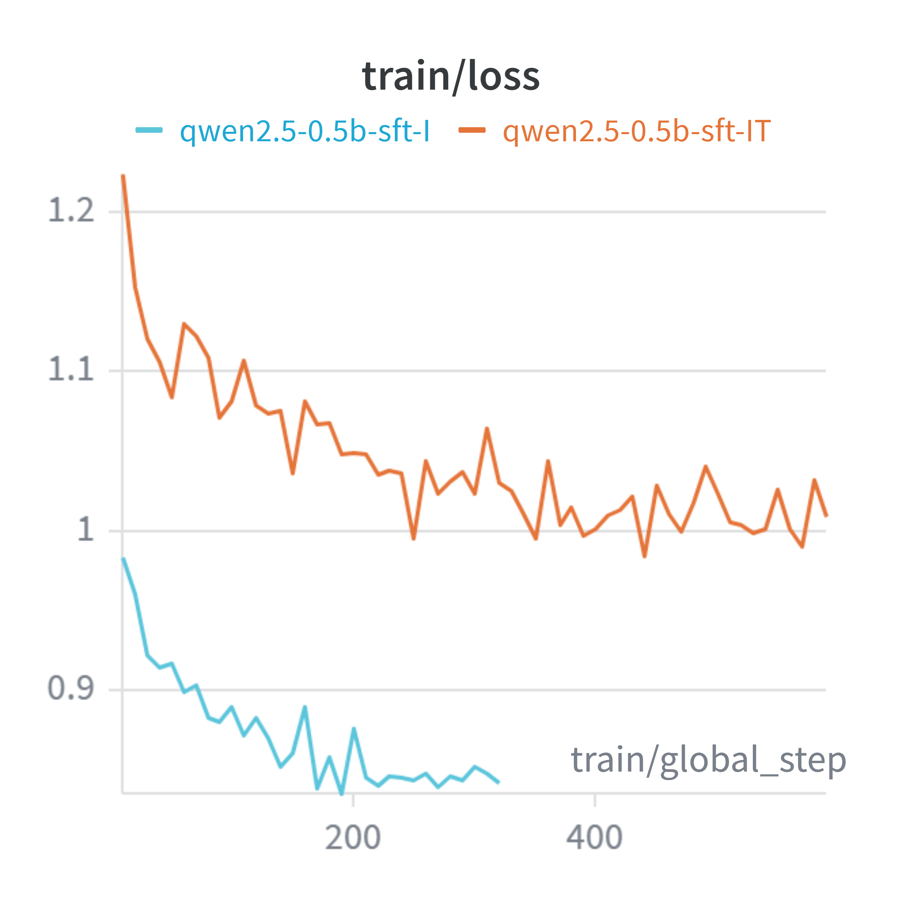
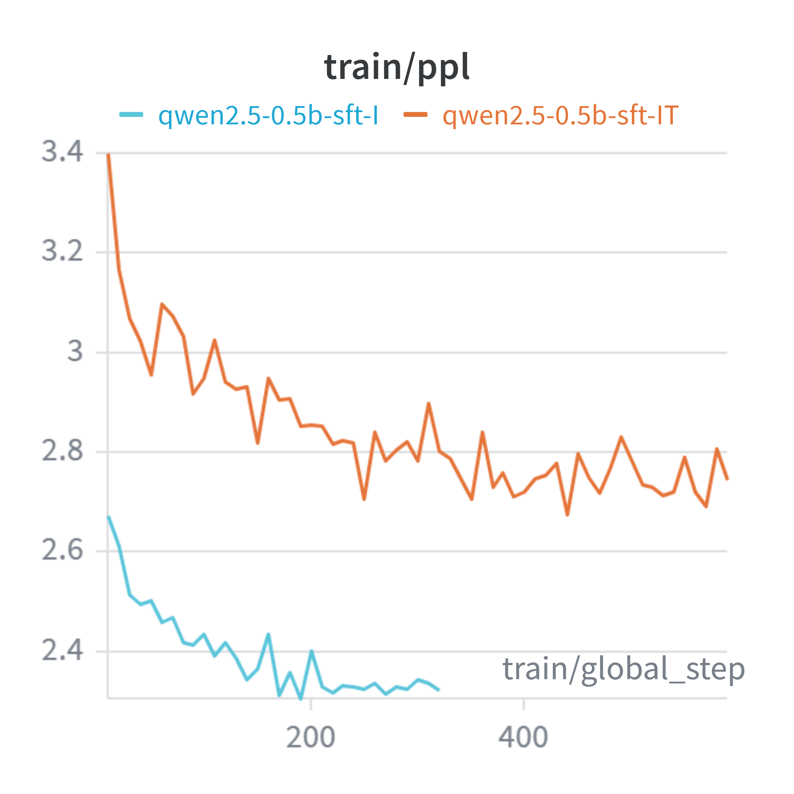
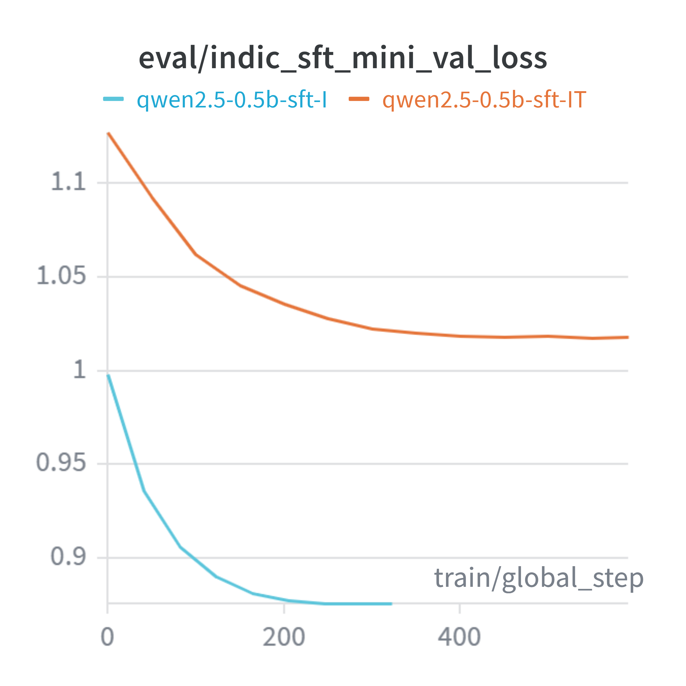
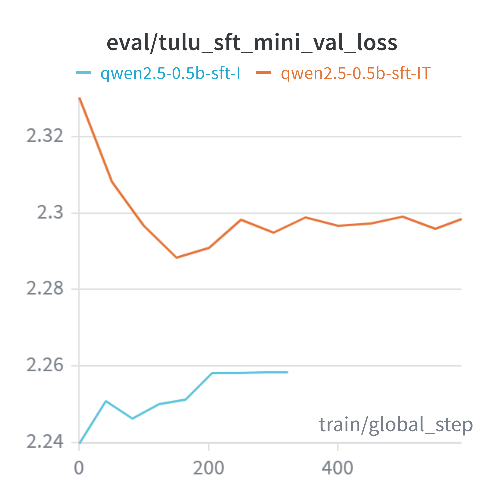

# Indic Language Training of **Qwen2.5-0.5B** on 10 Indian languages

Languages: Bengali, Gujarati, Hindi, Kannada, Malayalam, Marathi, Odia,
Punjabi, Tamil, Telugu (the 10 Sarvam-1 / IndicCorp v2 languages).

## Benchmark results

The pipeline is CPT → SFT → DPO, so each column is the checkpoint the next one
was trained from. English benchmarks come first (what the pipeline might have
broken), Indic second (what it was built for). Higher is better everywhere.

| | Benchmark | Metric | Base | Indic-CPT | CPT mix-1to2 | SFT-(Indic) | SFT-(Indic+Tulu) | DPO-(IndicToxic+AlignDataset) | DPO-IT (IndicToxic) | Sarvam-1† |
|---|---|---|---:|---:|---:|---:|---:|---:|---:|---:|
| **EN** | MMLU (5-shot) | accuracy | **47.54** | 47.51 | 47.44 | 25.06 | 29.62 | 31.86 | 31.24 | 47.04 |
| **EN** | IFEval prompt-strict | accuracy | 11.28 | 5.91 | 9.80 | 15.71 | **16.82** | 16.27 | 16.27 | 16.45 |
| **EN** | IFEval prompt-loose | accuracy | 12.94 | 6.65 | 10.91 | 18.11 | **18.30** | 16.64 | 17.56 | 18.67 |
| **EN** | IFEval inst-strict | accuracy | 21.22 | 8.75 | 16.43 | 27.58 | 27.10 | **28.66** | 27.22 | 26.62 |
| **IN** | XQuAD-IN (QA) | Token-F1 ×100 | 4.81 | 5.19 | 4.73 | 5.58 | 8.37 | 6.95 | **8.54** | 8.79 |
| **IN** | XORQA-IN (QA) | Token-F1 ×100 | 1.84 | 2.01 | 1.72 | 2.08 | **5.05** | 2.11 | 3.61 | 6.67 |
| **IN** | CrossSum-IN (summarization) | chrF | 1.59 | 2.56 | **2.58** | 2.47 | 0.61 | 0.42 | 0.35 | 1.60 |
| **IN** | Flores-IN en→xx (into Indic) | chrF | 7.38 | 8.46 | 8.64 | 7.63 | 8.40 | **9.83** | 9.31 | 18.65 |
| **IN** | Flores-IN xx→en (into English) | chrF | 14.23 | 7.17 | 12.74 | 4.19 | 11.46 | **15.03** | 11.75 | 31.73 |

Bold marks the best Qwen2.5-0.5B variant per row. † Sarvam-1 (~2B, Indic-native)
is an external reference ceiling, not a 0.5B variant, so it is excluded from the
bolding. MMLU stderr is ±0.36-0.41 on every model, so MMLU gaps under ~1 point
are noise; IFEval runs 541 prompts, so its gaps under ~3 points are noise.

### English (EN) benchmarks

Run with lm-evaluation-harness 0.4.12 via `run_lm_eval.py`, full test sets, no
subsampling. These are regression tests: none of them is a goal of the project,
but a 0.5B model has little capacity to spare, so they say what Indic training
cost in English ability.

**MMLU** — 14,042 four-way multiple-choice questions across 57 subjects (STEM,
humanities, social sciences, professional exams). Scored by loglikelihood: the
model never generates, it just ranks the four options, and accuracy is how often
the gold option ranks first. Run at **5-shot** (Open LLM Leaderboard convention) rather
than lm-eval's 0-shot default; for the chat-envelope models the 5 shots are laid
out as real conversation turns (`fewshot_as_multiturn`) instead of one glued-
together user message.\

**IFEval** — 541 prompts carrying *verifiable* instructions: "write at least 300
words", "reply in all lowercase", "wrap your answer in double quotes", "do not
use the word 'the'". Compliance is checked programmatically, so there is no judge
model and no rubric drift. Four numbers, reported because they disagree in
informative ways:

| Metric | What it counts |
|---|---|
| prompt-strict | fraction of prompts where **every** instruction was obeyed, verbatim check |
| prompt-loose | same, after normalizing markdown, casing and wrapper text |
| inst-strict | fraction of **individual instructions** obeyed (a prompt carries 1-3) |
| inst-loose | same, normalized |

*Caveat:* IFEval here decodes at most 512 new tokens, not lm-eval's stock 2048.
These checkpoints' `generation_config` forces 2048 and a base model never emits a
stop token on these prompts, so the full budget costs ~4x the runtime on this
hardware. The cap is identical for every model so the columns compare fairly, but
absolute IFEval values are **not** comparable to published leaderboard numbers.

### Indic (IN) benchmarks

Four IndicGenBench tasks over the 10 target languages, run by
`IndicGenBench/run_qwen_ft_benchmark.py`: 20 examples per task per language
(per direction for Flores), seed 42, greedy decoding, macro-averaged over the 10
languages.

**XQuAD-IN** — extractive QA, fully in-language: passage and question both in the
target language, and the answer is a span to be copied out of the passage. The
easiest of the four, since the answer is present in the input; it mostly tests
whether the model can read the script and locate a span.

**XORQA-IN** — cross-lingual open-retrieval QA: the passage is **English**, the
question is in the target language, and the answer must come back in the target
language. Requires cross-lingual transfer plus output-language control, so it is
the sharpest test of whether Indic and English representations actually connect.
Scored against `translated_answers`.

**CrossSum-IN** — cross-lingual summarization: English article in, one-sentence
summary in the target language out. Generative and open-ended, hence the most
fragile of the four.

**Flores-IN** — sentence translation, reported in both directions because they
fail differently. **en→xx** is Indic *generation*; **xx→en** is Indic
*comprehension* with English generation, so it doubles as an English-retention
probe — and indeed it tracks MMLU across the column, both collapsing at SFT-I.

## Continued Pre-Training (CPT)

### 1. Data (`data/`)

In the Continued Pre-Training phase the experiments are designed to test the
catastrophic forgetting hypothesis. The 2 main datasets around which the
experiments are run are `ai4bharat/IndicCorpV2` (the Indic side) and
`HuggingFaceFW/fineweb` (the English replay side).

> The data was assumed to be decontaminated from the established sources of the dataset.

**Slicing.** IndicCorp v2 is ~233GB across the 10 languages, so
`download_cpt_data.py` pulls a fixed **byte slice** of each per-language file
over HTTP range requests (~1.4GB each, trimmed back to the last complete
newline) instead of downloading the corpus. That slice is only a coarse
container — the actual dataset is cut from it by token count.

**The budget is in tokens, counted with the real tokenizer.**
`make_cpt_mini_dataset.py` walks each language slice line by line, encodes with
`Qwen/Qwen2.5-0.5B` itself (no bytes-per-token estimate), and stops at exactly
**1M tokens per language** → `indic-cpt-mini`, **30,506 rows / 9,900,820
tokens**. The FineWeb replay sets are then built to exact fractions of *that
number*, which is what makes the ratio experiments in §2 mean anything:

| Dataset | Rows | Tokens | Ratio to Indic |
|---|---:|---:|---:|
| `indic-cpt-mini-train` | 30,506 | 9,900,820 | 1 |
| `fineweb-cpt-1x` | 14,350 | 9,900,820 | 1 : 1 |
| `fineweb-cpt-half` | 7,248 | 4,950,410 | 1 : 2 |
| `fineweb-cpt-quater` | 3,600 | 2,475,205 | 1 : 4 |

**Why tokens and not characters, bytes or rows.** Indic scripts are badly
off-distribution for Qwen2.5's byte-level BPE: unseen script bytes fall back to
long token runs, so tokenizer efficiency varies enormously by language. Measured
on the dataset itself:

| Language | Rows | Characters | Tokens | Tokens/char |
|---|---:|---:|---:|---:|
| Odia (or) | 4,054 | 496,454 | 989,890 | **1.99** |
| Punjabi (pa) | 2,447 | 668,989 | 988,668 | 1.48 |
| Gujarati (gu) | 2,765 | 677,220 | 991,486 | 1.46 |
| Telugu (te) | 2,438 | 673,189 | 992,010 | 1.47 |
| Kannada (kn) | 3,357 | 718,471 | 991,185 | 1.38 |
| Malayalam (ml) | 2,402 | 729,777 | 983,734 | 1.35 |
| Bengali (bn) | 2,922 | 910,569 | 986,827 | 1.08 |
| Tamil (ta) | 2,760 | 917,992 | 995,206 | 1.08 |
| Marathi (mr) | 3,614 | 1,034,543 | 989,182 | 0.96 |
| Hindi (hi) | 3,747 | 1,080,678 | 992,632 | 0.92 |
| **English** (FineWeb) | 14,350 | 44,254,060 | 9,900,820 | **0.22** |

Odia costs ~**9x more tokens than English for the same number of characters**
(~3x if measured per UTF-8 byte, since Odia code points are 3 bytes each), and
~2.2x more than Hindi. Sizing by characters, bytes or rows would therefore have
given each language a wildly different amount of actual *training signal*, and
the Indic : English replay ratios would have been fiction. Equal token budgets
are what the model sees; the price is visibly unequal text volume — the same ~1M
tokens is 1.08M characters of Hindi but only 0.50M characters of Odia.

### 2. CPT training (`cpt_training/`)
Axolotl configs for full-parameter next-token training (`type: completion`) on
raw Indic text, single-GPU, with sequence packing.

| Config | What it trains |
|---|---|
| `qwen2.5_0.5b_cpt_full.yml` | Indic only |
| `qwen2.5_0.5b_cpt_frozen.yml` | only first/last 3 layers + embeddings/norm trainable |
| `qwen2.5_0.5b_cpt_mix_1to4.yml` | Indic : FineWeb replay at ratio 4:1 experiments |
| `qwen2.5_0.5b_cpt_mix_1to2.yml` | Indic : FineWeb replay at ratio 2:1 experiments |
| `qwen2.5_0.5b_cpt_mix_1to1.yml` | Indic : FineWeb replay at ratio 1:1 experiments |

- **`multi_eval_plugin.py`** — Axolotl plugin that logs a **separate** eval loss
  per validation source (`eval_indic_cpt_mini_val_loss` vs
  `eval_fineweb_cpt_val_loss`) instead of one blended number.
- **`train.py`** — launcher: pins one GPU and invokes `axolotl train <config>`.
- **`artifacts/`** — training loss/perplexity and Indic/FineWeb validation curves.

### 3. Evaluation

#### 3.1 Model validation losses

Five CPT configs were tracked in Weights & Biases — `indic-cpt-full` (full-param,
Indic only), `indic-cpt-frozen` (only first/last 3 layers + embeddings/norm),
and the three replay mixes `cpt-mix-1to1 / 1to2 / 1to4` (Indic : FineWeb-English).
The `multi_eval_plugin` logs held-out loss **separately** on an Indic set and a
FineWeb (English) set, so Indic learning and English forgetting can be read off
independently.

| Training loss | Training perplexity |
|---|---|
|  |  |

| Held-out Indic eval loss | Held-out FineWeb (English) eval loss |
|---|---|
|  |  |

#### 3.2 Benchmark scores  (`IndicGenBench/`)

Runs the CPT'd model (`run_qwen_ft_benchmark.py`) over four IndicGenBench tasks and scores it per the benchmark's protocol:

| Task | Type | Metric |
|---|---|---|
| XQuAD-IN | in-language extractive QA | SQuAD Token-F1 |
| XORQA-IN | cross-lingual open-retrieval QA | SQuAD Token-F1 |
| CrossSum-IN | cross-lingual summarization | chrF |
| Flores-IN | translation (en→xx and xx→en) | chrF |

Scored with `run_qwen_ft_benchmark.py` (direct HF `transformers` inference on an
Intel Arc XPU): 20 examples/language, seed 42, greedy decoding, macro-averaged
across the 10 languages. Higher is better throughout.

Models: **Base** = `Qwen2.5-0.5B` (no CPT) · **Indic-CPT** =
`qwen2.5-0.5b-indic-cpt` (Indic only) · **Mix-1to1 / 1to2 / 1to4** =
`qwen2.5-0.5b-cpt-mix-*` (Indic + FineWeb English replay at 1:1, 1:2, 1:4
Indic:English ratios — larger denominator = more English replay). **Sarvam-1†** =
`sarvamai/sarvam-1`, a ~2B Indic-native model included as a stronger external
reference (a rough ceiling), **not** a 0.5B CPT variant.

| Task | Metric | Base | Mix-1to1 | Mix-1to2 | Mix-1to4 | Indic-CPT | Best 0.5B | Sarvam-1† |
|---|---|---:|---:|---:|---:|---:|:--:|---:|
| XQuAD-IN (QA) | Token-F1 ×100 | 4.81 | 2.05 | 4.73 | 5.07 | **5.19** | Indic-CPT | 8.79 |
| XORQA-IN (QA) | Token-F1 ×100 | 1.84 | 1.06 | 1.72 | **2.32** | 2.01 | Mix-1to4 | 6.67 |
| CrossSum-IN (summarization) | chrF | 1.59 | 0.43 | 2.58 | **3.15** | 2.56 | Mix-1to4 | 1.60 |
| Flores-IN en→xx (into Indic) | chrF | 7.38 | 7.57 | **8.64** | 8.49 | 8.46 | Mix-1to2 | 18.65 |
| Flores-IN xx→en (into English) | chrF | **14.23** | 6.51 | 12.74 | 11.26 | 7.17 | Base | 31.73 |

† The **Best 0.5B** column names the winner *among the Qwen2.5-0.5B variants only*;
Sarvam-1 (~2B) is listed separately as an external reference, so bolding and the
"best" label are kept within the same-size CPT experiments.

## Supervised Fine-Tuning (SFT) + Direct Preference Optimization (DPO)

Both stages start from `qwen2.5-0.5b-cpt-mix-1to2` (the replay-mixed CPT
checkpoint): CPT → SFT → DPO, each stage initialised from the previous one.

### 1. Data

#### 1.1 SFT data (`data/`)

Two ingredients, one Indic and one English, built to an exact token budget rather
than to an example count.

| Ingredient | Source | Build script | What it is |
|---|---|---|---|
| Indic instructions | `ai4bharat/indic-align` (IndicAlign) | `data/SFT/build_sft_indicalign.py` | 6 instruct sub-datasets, native script, balanced across the 10 languages |
| English replay | `allenai/tulu-3-sft-mixture` | `data/tulu_sft/count_indic_and_fetch_tulu.py` | general-purpose English SFT, streamed to a measured token target |

**Indic side.** IndicAlign's instruct subsets are *n-way parallel* (one row =
the same exchange in every language), so taking N rows per source yields exactly
N records per language. 8,000 rows/language → **80,000 records**, later rebuilt
at 10,000/language → **100,000**:

| Source | Rows/lang | Task |
|---|---:|---|
| Indic-ShareLlama | 1,500 | instruction (open QA) |
| Dolly-T | 1,500 | instruction (task-diverse) |
| Wiki-Conv | 1,500 | chat (short multi-turn) |
| OpenAssistant-T | 1,250 | chat (multi-turn) |
| WikiHow | 1,250 | how-to |
| Wiki-Chat | 1,000 | chat (long conversations) |

IndoWordNet (dictionary-terse) and Anudesh (English-heavy) were dropped for
quality; **the safety subsets HHRLHF-T and Toxic-Matrix were deliberately held
back** — they are the raw material for DPO (§1.2), and spending them at SFT would
have burned the only native preference signal available.

**English side.** Not a fixed number of examples:
`count_indic_and_fetch_tulu.py` tokenizes the Indic set with the Qwen2.5
tokenizer (232,334,967 tokens over 80k records), then streams Tulu-3 until it has
collected exactly half of that (116,168,274 tokens → **138,488 examples**, ratio
0.50000). Identical `apply_chat_template` → tokenize path on both sides, so the
mix ratio is a real token ratio, not an example-count proxy.

**Cap and rebalance.** 90k Indic + 72k Tulu train rows (~350M tokens) was well
past the local compute budget, so `data/cap_and_rebalance.py` cuts it to a
**50M-token** budget with *equal records per language* — binary-searching the
per-language record count against per-language token prefix sums, so the cut is
token-bounded but stays language-balanced. Tulu is then sized to 60% of the Indic
**row** count in each split.

| Split (HF repo) | Rows | Per language |
|---|---:|---|
| `indic-sft-mini-train` | 17,250 | 1,725 |
| `indic-sft-mini-val` | 1,920 | 192 |
| `tulu-sft-mini-train` | 10,350 | — |
| `tulu-sft-mini-val` | 1,152 | — |

Record schema is chat format throughout: `{language, source, task, num_turns,
messages:[{role, content}...]}`, with multi-turn sequences preserved.

#### 1.2 DPO data (`dpo_training/`) — **Synthetic preference generation**

There is essentially **no native Indic preference data**. Every triplet used here
was generated, and in all of them the `rejected` side is **synthetic — sampled
from a model, never harvested**. Only the `chosen` side is real text.

Two tracks, differing in where `chosen` comes from:

```
Track A (safety)       IndicAlign-Toxic ──▶ prompt   = harmful request
                       HHRLHF-T                chosen   = human-aligned refusal
                       Toxic-Matrix            rejected = Base-model sample

Track B (instruction)  indic/tulu-sft-mini ─▶ prompt   = turns up to the last user turn
                                              chosen   = the SFT gold assistant turn
                                              rejected = Base-model sample
```

**Track A — safety.** `download_indicalign_toxic.py` range-reads only the 10
native-script columns of the two toxic parquets (no full-file download) and
collects 1,500 pairs per language per source → **30,000 `(prompt, chosen)`
pairs**, uniform over 10 languages × 2 sources.

**Track B — instruction.** `download_and_sample_sft.py` samples the SFT splits
themselves: 625 Indic records/language (6,250) plus Tulu at 60% (3,750), with a
proportionally sampled val set. Splitting a chat record at its last user turn
turns SFT supervision into a preference prompt for free.

**Generating `rejected`.** `generate_all_rejected.py` loads one model once and
runs every job through it (`temperature 0.8`, `top_p 0.95`, 256 new tokens, seed
42, left-padded batched generation, append-and-resume so a kill never loses
work). *Which* model writes the negatives is the design decision:

| Generator | Effect on the contrast |
|---|---|
| **`sft-IT` (used — on-policy)** | negatives are the policy's own current failures, i.e. the errors DPO can actually fix |
| `Qwen2.5-0.5B` base (off-policy, `generate_rejected*.py`) | negatives are far from the policy; separable on script/length cues alone |
| an Instruct model | it *also* refuses the toxic prompt, so the pair degenerates into "detailed Indic refusal vs curt English refusal" — a language-consistency signal, not safe-vs-unsafe |

**Rebalancing the mix.** The toxic track alone is 29,400 of 39,400 training
triplets (75%), which drowns the instruction preferences. `downsample_toxic.py`
keeps **30% of each `(language, source)` cell** — stratified rather than globally
random, so the per-language safety balance survives the cut.

Datasets created:

| File | Train | Val | Content |
|---|---:|---:|---|
| `data/sft_source/indicalign_toxic_pairs.jsonl` | 30,000 | — | Track A pairs, pre-generation |
| `data/sft_source/toxic_dpo_triplets_*.jsonl` | 29,400 | 600 | Track A triplets (full) |
| `data/toxic_dpo_triplets_*_30pct.jsonl` | 8,820 | 180 | Track A, stratified 30% — **used** |
| `data/indic_dpo_*.jsonl` | 6,250 | 700 | Track B, Indic |
| `data/tulu_dpo_*.jsonl` | 3,750 | 420 | Track B, English |
| **DPO mix** | **18,820** | **1,300** | 47% safety / 33% Indic / 20% English |

All files are in HF/TRL conversational preference format
(`{prompt, chosen, rejected}` + `language`/`source` metadata). `check_jsonl.py`
validates them before training — one truncated line from an interrupted
generation run makes `load_dataset` fail with a row index that points into an
arrow batch, not into the file.

### 2. SFT and DPO training

#### 2.1 SFT (`sft_training/`)

Two runs, one variable: **whether English is in the SFT mix at all.**

| Run | Config | Train data | Question it answers |
|---|---|---|---|
| `sft-I` | `qwen2.5_0.5b_sft_I.yml` | Indic only (17,250) | how far Indic-only instruction tuning goes |
| `sft-IT` | `qwen2.5_0.5b_sft_IT.yml` | Indic + Tulu (27,600) | whether English replay protects English ability, as it did during CPT |

Shared: full-parameter from `cpt-mix-1to2`, 2 epochs, lr 2e-5 cosine, warmup
0.03, weight decay 0.01, seq 4096 with sample packing, effective batch 32
(micro 4 × accum 8), bf16 + FlashAttention-2 + gradient checkpointing.
`train_on_inputs: false` masks the user/system turns so **loss is computed on
assistant tokens only** — the one setting that separates SFT from more CPT.
`multi_eval_plugin` logs Indic and Tulu held-out loss as separate metrics.

| Training loss | Training perplexity |
|---|---|
|  |  |

| Held-out Indic loss | Held-out Tulu (English) loss |
|---|---|
|  |  |

Read the **slopes**, not the levels — the two runs see different data, so the
absolute losses are not comparable. Both converge cleanly on Indic. On English
they differ in *direction*: `sft-I`'s Tulu loss **rises monotonically from step
0** (nothing in its mix defends English), while `sft-IT`'s falls, then plateaus.
Note the magnitudes too: `sft-I` gives up only ~0.02 nats of English loss yet
loses *all* of MMLU (§3) — held-out loss on English text is a weak proxy for
retained English knowledge.

#### 2.2 DPO (`dpo_training/`)

Two runs, one variable: **whether the instruction preferences are in the mix.**
Both start from `sft-IT`, with the frozen reference model defaulting to that same
checkpoint.

| Run | Train mix | Question it answers |
|---|---|---|
| `dpo-IT` | toxic 30% + Indic + Tulu (18,820) | the full preference mix |
| `dpo-IT_non_align` | toxic only | isolates the safety signal — do the IndicAlign-derived instruction preferences help, or only perturb? |

Shared: `rl: dpo`, `beta 0.1`, 1 epoch, lr 5e-6 cosine, warmup 0.1, weight decay
0, seq 4096. Deliberately gentler than SFT (¼ the LR, half the epochs, longer
warmup): DPO is meant to re-rank behaviour the SFT model already has, not to
teach new behaviour.

Two constraints shape the rest of the config:

- **No packing** (unsupported for DPO), and **truncation is destructive** —
  cutting a completion mid-way corrupts the preference pair rather than merely
  shortening it. At 4096 tokens only 3.9% of the 41,120 triplets truncate (vs
  9.1% at 2048 and 36.8% at 1024), so sequence length is fixed and memory is
  bought elsewhere.
- **Logits, not weights, set the batch size.** Model + optimizer + activations is
  only ~4.5 GiB; one 4096-token sequence costs 2.32 GiB of fp32 logits against a
  152k vocab, DPO concatenates chosen+rejected (micro-batch N = 2N sequences),
  and a non-contiguous slice forces a second full copy — peak is `2 × 2N × 2.32
  GiB`. Hence `micro_batch_size: 2` (~23 GiB) with `accum 8` to hold the
  effective batch at 32 across 2 GPUs.

DDP rather than FSDP on 2× RTX 5880 Ada: the policy and its frozen reference both
fit in 48 GB, and without NVLink, FSDP's per-layer all-gathers cost more PCIe
traffic than one gradient all-reduce per step.
`qwen2.5_0.5b_dpo_IT_8xh100_fsdp.yml` is the FSDP2 scale-out variant (same data
and objective, 8× H100).

### 3. Benchmark scores — the SFT/DPO ablation

Same protocol as §3.2 above (`run_qwen_ft_benchmark.py` for Indic,
`run_lm_eval.py` for English), with the post-training checkpoints scored **in
their own chat envelope**. `CPT mix-1to2` is the checkpoint all four were trained
from, repeated here as the baseline.

| | Benchmark | CPT mix-1to2 | SFT-I (Indic) | SFT-IT (Indic+Tulu) | DPO (Toxic+Align) | DPO (Toxic only) |
|---|---|---:|---:|---:|---:|---:|
| **EN** | MMLU (5-shot) | **47.44** | 25.06 | 29.62 | 31.86 | 31.24 |
| **EN** | IFEval prompt-strict | 9.80 | 15.71 | **16.82** | 16.27 | 16.27 |
| **EN** | IFEval inst-strict | 16.43 | 27.58 | 27.10 | **28.66** | 27.22 |
| **IN** | XQuAD-IN | 4.73 | 5.58 | 8.37 | 6.95 | **8.54** |
| **IN** | XORQA-IN | 1.72 | 2.08 | **5.05** | 2.11 | 3.61 |
| **IN** | CrossSum-IN | **2.58** | 2.47 | 0.61 | 0.42 | 0.35 |
| **IN** | Flores en→xx | 8.64 | 7.63 | 8.40 | **9.83** | 9.31 |
| **IN** | Flores xx→en | 12.74 | 4.19 | 11.46 | **15.03** | 11.75 |

What the ablation says:

- **SFT buys instruction-following and pays for it in knowledge.** IFEval
  prompt-strict goes 9.80 → 15.71/16.82 and inst-strict 16.43 → ~27, while MMLU
  falls to **25.06 — exactly random chance** for `sft-I`. At 0.5B there is no
  spare capacity: the model learns the response format by overwriting what it
  knew.
- **English in the SFT mix is what makes that survivable.** `sft-IT` beats
  `sft-I` everywhere it matters: MMLU +4.6, XORQA 5.05 vs 2.08, and Flores xx→en
  11.46 vs **4.19** — the Indic-only run loses the ability to *generate* English
  almost entirely. Same lesson as the CPT replay ablation (§3.2), one stage later
  and much sharper.
- **DPO repairs rather than teaches.** Both runs recover ~2 MMLU points over
  `sft-IT`, and the full mix lifts Flores xx→en to 15.03 — above the base model's
  14.23 and the best number any 0.5B variant here reaches. IFEval barely moves;
  every SFT→DPO gap on it sits inside the ~3-point noise band. That is the
  expected shape for preference tuning: it re-ranks existing behaviour.
- **The two DPO mixes trade off cleanly.** Toxic-only is better on the
  in-language QA rows (XQuAD 8.54, XORQA 3.61) — fewer and narrower updates leave
  the SFT model's span-extraction behaviour intact. The full mix, whose negatives
  are on-policy samples over general instructions, is better on both translation
  directions and on MMLU. Neither dominates: the safety-only run is the lighter
  touch, the full mix the better generator.
- **CrossSum degrades at SFT and never comes back** (2.58 → 0.61 → 0.42/0.35).
  Largely a length artifact rather than a comprehension one: the
  instruction-tuned checkpoints write ~279-character summaries against
  165-character references, and chrF penalizes the excess (see §Indic
  benchmarks).

