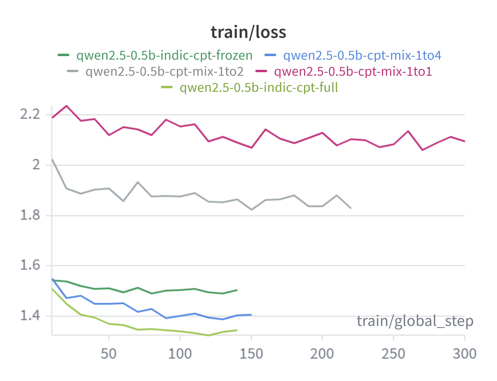
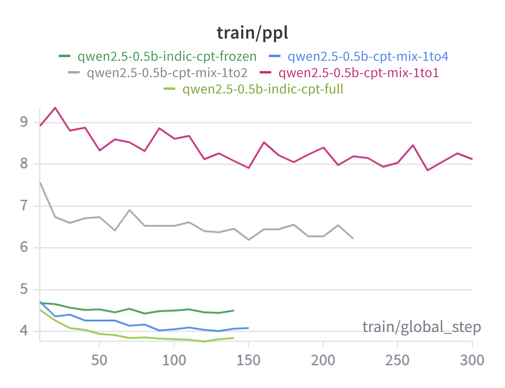
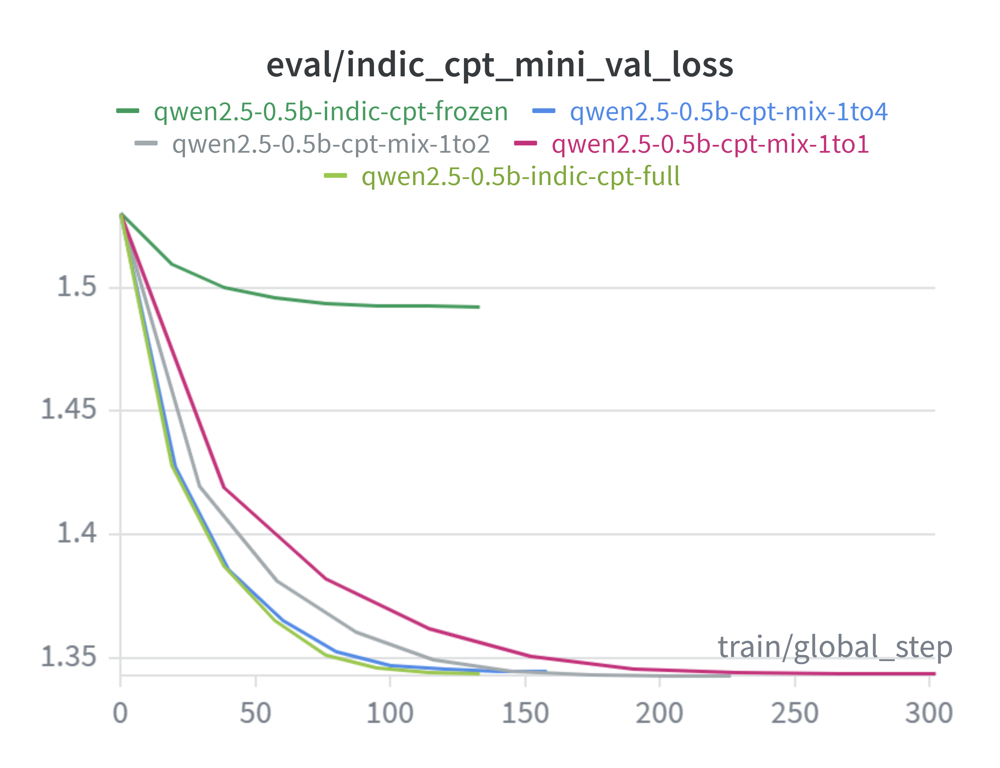
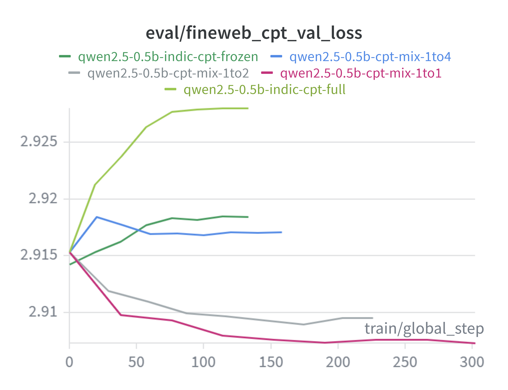

# Indic Language Training of **Qwen2.5-0.5B** on 10 Indian languages

Languages: Bengali, Gujarati, Hindi, Kannada, Malayalam, Marathi, Odia,
Punjabi, Tamil, Telugu (the 10 Sarvam-1 / IndicCorp v2 languages).

## Continued Pre-Training (CPT)

### 1. Data (`data/`)

### 2. CPT training (`cpt_training/`)
Axolotl configs for full-parameter next-token training (`type: completion`) on
raw Indic text, single-GPU, with sequence packing.

| Config | What it trains |
|---|---|
| `qwen2.5_0.5b_cpt_full_test_sample.yml` | quick end-to-end smoke test |
| `qwen2.5_0.5b_cpt_full.yml` | full-parameter, Indic only |
| `qwen2.5_0.5b_cpt_frozen.yml` | only first/last 3 layers + embeddings/norm trainable |
| `qwen2.5_0.5b_cpt_mix_1to4.yml` | Indic : FineWeb replay at ratio 4:1 experiments |
| `qwen2.5_0.5b_cpt_mix_1to2.yml` | Indic : FineWeb replay at ratio 2:1 experiments |
| `qwen2.5_0.5b_cpt_mix_1to1.yml` | Indic : FineWeb replay at ratio 1:1 experiments |

- **`multi_eval_plugin.py`** — Axolotl plugin that logs a **separate** eval loss
  per validation source (`eval_indic_cpt_mini_val_loss` vs
  `eval_fineweb_cpt_val_loss`) instead of one blended number.
- **`train.py`** — launcher: pins one GPU and invokes `axolotl train <config>`.
- **`artifacts/`** — training loss/perplexity and Indic/FineWeb validation curves.

### 3. Evaluation

#### 3.1 Model validation losses

Five CPT configs were tracked in Weights & Biases — `indic-cpt-full` (full-param,
Indic only), `indic-cpt-frozen` (only first/last 3 layers + embeddings/norm),
and the three replay mixes `cpt-mix-1to1 / 1to2 / 1to4` (Indic : FineWeb-English).
The `multi_eval_plugin` logs held-out loss **separately** on an Indic set and a
FineWeb (English) set, so Indic learning and English forgetting can be read off
independently.

| Training loss | Training perplexity |
|---|---|
|  |  |

| Held-out Indic loss | Held-out FineWeb (English) loss |
|---|---|
|  |  |

#### 3.2 Benchmark scores  (`IndicGenBench/`)

Runs the CPT'd model (`run_qwen_ft_benchmark.py`) over four IndicGenBench tasks and scores it per the benchmark's protocol:

| Task | Type | Metric |
|---|---|---|
| XQuAD-IN | in-language extractive QA | SQuAD Token-F1 |
| XORQA-IN | cross-lingual open-retrieval QA | SQuAD Token-F1 |
| CrossSum-IN | cross-lingual summarization | chrF |
| Flores-IN | translation (en→xx and xx→en) | chrF |

##### Results

Scored with `run_qwen_ft_benchmark.py` (direct HF `transformers` inference on an
Intel Arc XPU): 20 examples/language, seed 42, greedy decoding, macro-averaged
across the 10 languages. Higher is better throughout.

Models: **Base** = `Qwen2.5-0.5B` (no CPT) · **Indic-CPT** =
`qwen2.5-0.5b-indic-cpt` (Indic only) · **Mix-1to1 / 1to2 / 1to4** =
`qwen2.5-0.5b-cpt-mix-*` (Indic + FineWeb English replay at 1:1, 1:2, 1:4
Indic:English ratios — larger denominator = more English replay).

| Task | Metric | Base | Mix-1to1 | Mix-1to2 | Mix-1to4 | Indic-CPT | Best |
|---|---|---:|---:|---:|---:|---:|:--:|
| XQuAD-IN (QA) | Token-F1 ×100 | 4.81 | 2.05 | 4.73 | 5.07 | **5.19** | Indic-CPT |
| XORQA-IN (QA) | Token-F1 ×100 | 1.84 | 1.06 | 1.72 | **2.32** | 2.01 | Mix-1to4 |
| CrossSum-IN (summarization) | chrF | 1.59 | 0.43 | 2.58 | **3.15** | 2.56 | Mix-1to4 |
| Flores-IN en→xx (into Indic) | chrF | 7.38 | 7.57 | **8.64** | 8.49 | 8.46 | Mix-1to2 |
| Flores-IN xx→en (into English) | chrF | **14.23** | 6.51 | 12.74 | 11.26 | 7.17 | Base |

**Takeaways:**

- **English replay is the key lever, and it works.** Pure Indic-CPT catastrophically
  forgets English — Flores xx→en drops from **14.23 → 7.17** (roughly halved). Adding
  FineWeb English replay at 1:2 or 1:4 restores most of it (**12.74 / 11.26**) while
  *keeping* the Indic gains (en→xx ~8.5, CrossSum 2.6–3.2). This is the classic
  rehearsal effect: a modest amount of replay largely fixes forgetting at little
  cost to the new skill.
- **Indic gains are robust across every trained variant.** All of them push en→xx
  above base (7.38 → ~8.5) and lift CrossSum and QA. CPT reliably improves
  generation *into* Indic; the replay ratio mainly controls how much English you
  keep, not how much Indic you gain.
- **Mix-1to4 is the best-balanced model** — it wins XORQA and CrossSum, is
  near-top on XQuAD and en→xx, *and* retains strong English (xx→en 11.26).
  Mix-1to2 gives the best English retention among the trained models plus the best
  en→xx. Pure Indic-CPT edges the QA tasks but pays for it in English.
- **Mix-1to1 is an outlier that breaks the ratio trend** — its xx→en (6.51) and
  CrossSum (0.43) fall far below its 1to2/1to4 siblings, which otherwise form a
  clean, sensible gradient. This points to a bad or under-trained 1to1 run rather
  than a genuine ratio effect; re-run it before trusting its numbers.
- **The QA numbers are near the floor** (Token-F1 < 6). A 0.5B *base* model doing
  zero-shot extractive QA on raw completion prompts is essentially at chance, so
  model-to-model QA differences are within noise. The reliable signal is the two
  Flores directions and CrossSum.

Caveats: 20 examples/language, greedy decoding, and chrF is low in absolute terms
because these are tiny base (non-instruct) models on raw completion prompts.
